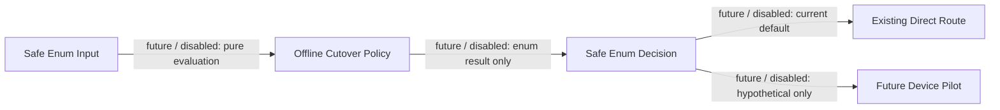

# Lemtel Control Plane - Phase 7 offline cutover policy

- The module is not imported by the application, server or routes and cannot receive a request in Phase 7.
- The existing direct route remains the current default.
- `edge_pilot` and `shadow_observe` results are hypothetical and cannot change a client route, registration, PBX or Edge.
- `shadow_observe` does not authorize registration, signalling or media.
- Future Edge selection requires the direct route for that device already withdrawn and no current active mode.
- Rollback only authorizes an eventual future decision; an approved future integration must revoke Edge before restoration is performed.
- Future pilot prerequisites include an approved non-production upstream.
- The policy is provider-neutral and contains no provider host, credential, endpoint or connectivity configuration.
- Every Phase 2 gate remains false.

Pending gate: the Phase 1 Docker runtime validation from `docs/lemtel-control-plane/local-development.md` is still pending. It blocks every runtime, deployment, integration, gate and pilot action.
