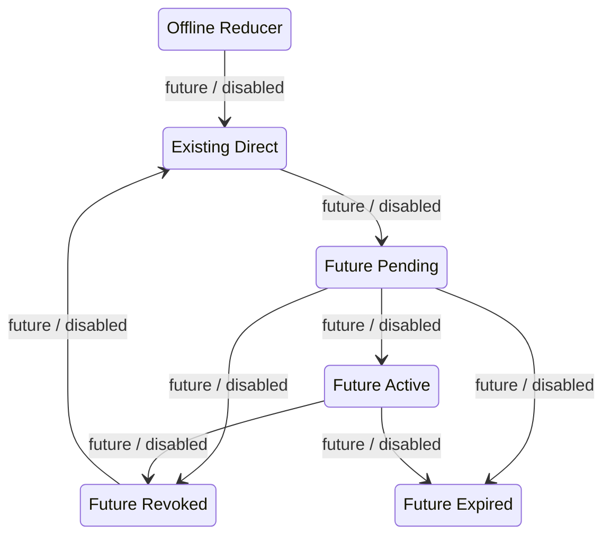

# Phase 8 — Offline device-assignment lifecycle reducer

The reducer is a pure, deterministic, offline proposal calculator. It is not imported by the application, server or routes and cannot receive a request.

It does not store an assignment, call a service, update a client or control registration or media. Every result is a hypothetical proposal only.

- A future non-direct mode begins only as pending, then becomes active only with explicit confirmation.
- Rollback is two-step: edge assignment revocation confirmation first, direct restoration confirmation second.
- Expiry ends only a pending or active future assignment and never restores direct routing.
- Policy denial always holds the current snapshot unchanged.
- Existing direct remains the current default.
- All Phase 2 gates remain false.
- Phase 1 Docker runtime validation remains pending and blocks every runtime, deployment, upstream connection, registration migration, client cutover, gate activation and pilot call.
