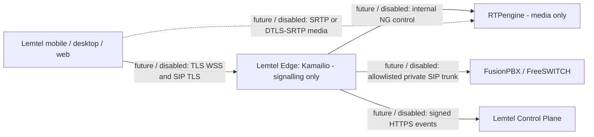

# Lemtel Edge - Phase 2 architecture (offline)

No service runs in Phase 2. This phase only adds inert templates, policies, schemas and static checks. No existing app is changed in Phase 2.

- Kamailio is the only selected signalling proxy; RTPengine is the only selected media relay.
- In the target architecture, clients never connect directly to FusionPBX. Only the future Edge may reach it.
- The Control Plane and the read-only `/lemtel-uc` preview stay isolated from this package.

Pending gate: the Phase 1 Docker runtime validation from `docs/lemtel-control-plane/local-development.md` is still pending. It must pass before any Edge container, deployment, FusionPBX integration, client cutover or pilot call.
