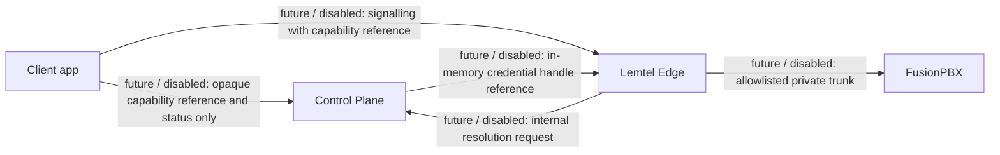

# Lemtel Edge - Phase 4 identity contract

Phase 4 is a specification only: schemas, documentation and static checks. It changes no app, database, service, Edge config or provider.

- The tenant / extension / device binding lives future server-side only.
- Client apps receive an opaque capability reference and its status only. They never receive a raw SIP or PBX credential or the PBX host.
- Every identifier is an opaque reference matching the fixed pattern; never a phone number, extension digits, email, address, SIP URI or hostname.
- Schemas: `schemas/lemtel-edge/identity/`. Every object rejects additional fields.

Pending gate: the Phase 1 Docker runtime validation from `docs/lemtel-control-plane/local-development.md` is still pending. It blocks every runtime, deployment, integration, gate and pilot action.
