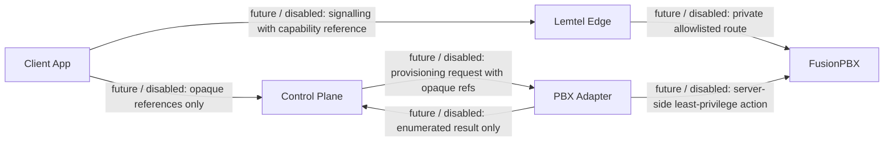

# Lemtel Edge - Phase 5 PBX adapter contract (future)

Phase 5 is a specification only: schemas, documentation and static checks.

- Client traffic never reaches FusionPBX directly.
- The future Edge only reaches FusionPBX over a separately approved private/allowlisted route.
- Phase 5 creates no adapter, connection, tenant, extension, device, credential or PBX change.
- This contract works only with opaque refs and safe enumerated statuses. Schemas: `schemas/lemtel-edge/pbx/`.

Pending gate: the Phase 1 Docker runtime validation from `docs/lemtel-control-plane/local-development.md` is still pending. It blocks every runtime, deployment, integration, gate and pilot action.
