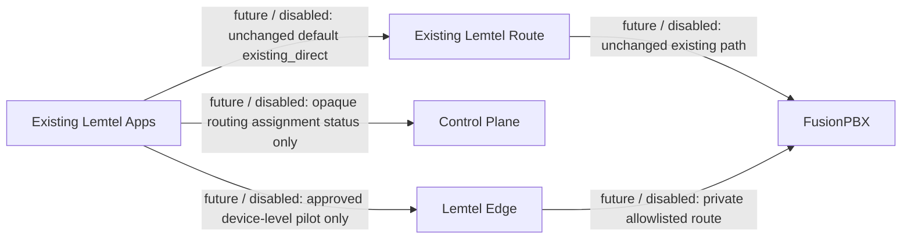

# Lemtel Edge - Phase 6 existing-app coexistence and routing (future)

- Existing apps and the existing route remain the production default, unchanged. `existing_direct` is the default mode.
- `shadow_observe` never registers and never carries SIP or media.
- A future `edge_pilot` is device-level, explicitly approved and non-production first.
- A device may never have direct and Edge registration simultaneously.
- The future Edge route cannot be selected until the direct route for that device is withdrawn and all pilot prerequisites are satisfied.
- Phase 6 does not change the app, portal, Edge, PBX or any route.

Pending gate: the Phase 1 Docker runtime validation from `docs/lemtel-control-plane/local-development.md` is still pending. It blocks every runtime, deployment, integration, gate and pilot action.
