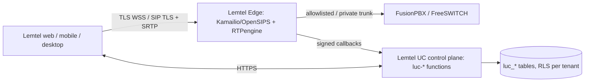

# Lemtel UC — Architecture

Lemtel apps connect to **Lemtel Edge**, never directly to FusionPBX.

- Control plane (this repo): `src/pages/lemtel-uc`, `supabase/functions/luc-*`, `luc_*` tables.
- Edge contract: `luc-edge` accepts `invite_push` and `registration_health`, signed with `x-luc-signature = hex(HMAC-SHA256(LUC_EDGE_SECRET, body))`.
- Device credentials: `luc-device` issues a 12 h device-bound status; the secret itself is only for Edge.
- FusionPBX adapter: `luc-pbx-adapter` (mock until the owner approves an integration method).
- Isolation: no reads/writes to Planiprêt or legacy Lemtel PBX data.
